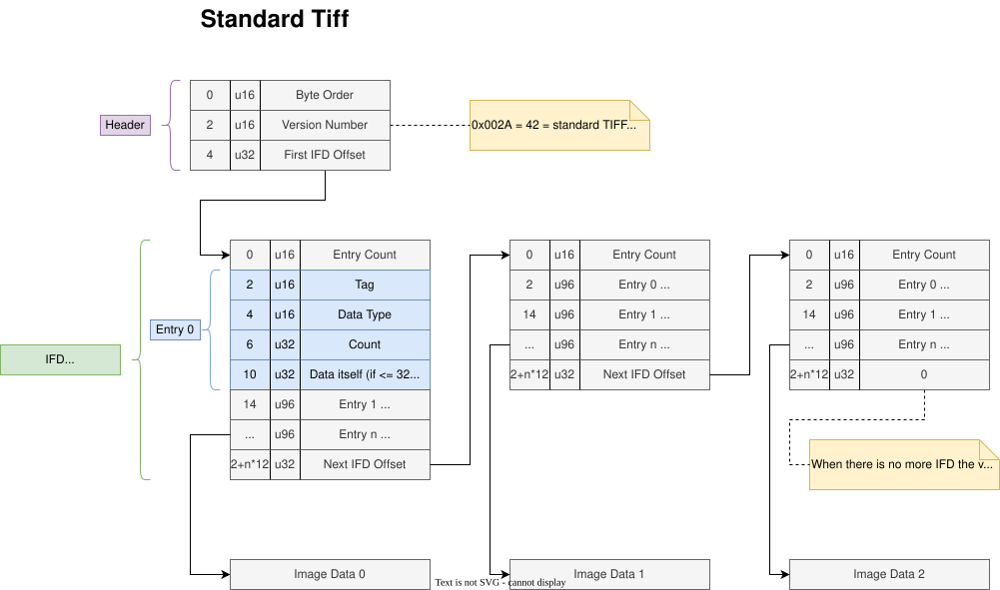
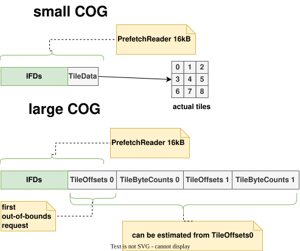

# RataTiff: Tiff + Ratatui

I've always wanted a tool to visualize tiff files' internal structure and such.

Well, maybe here it's possible?

Anyways, I thought it'd be superduper nice to sort of have these images:

generate for you based on a specific tiff file + extension, That'd be cool!

Also I find making a tui that visualizes your lirary is a good reason to be using the lower-level apis that are normally rarely used.
